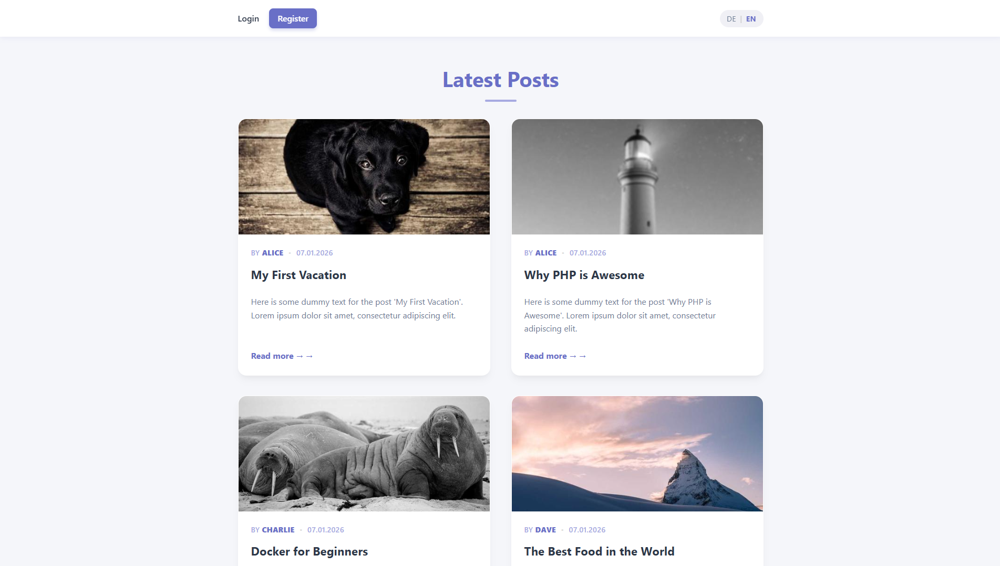
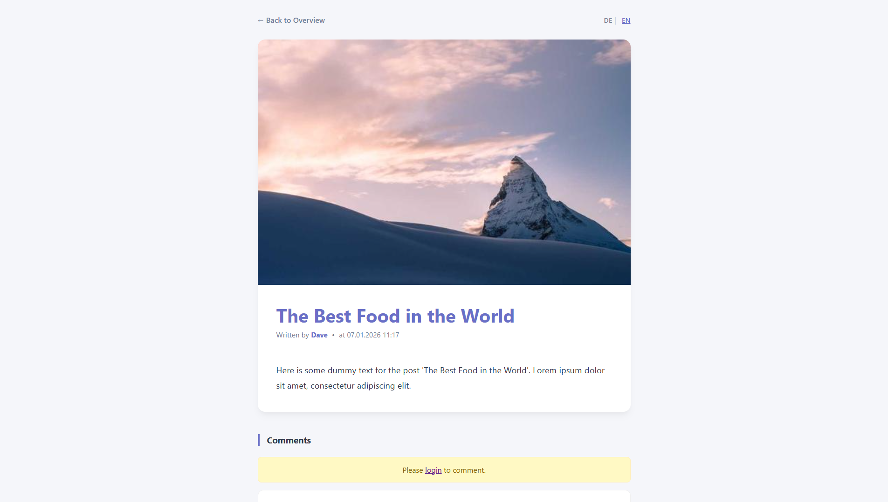
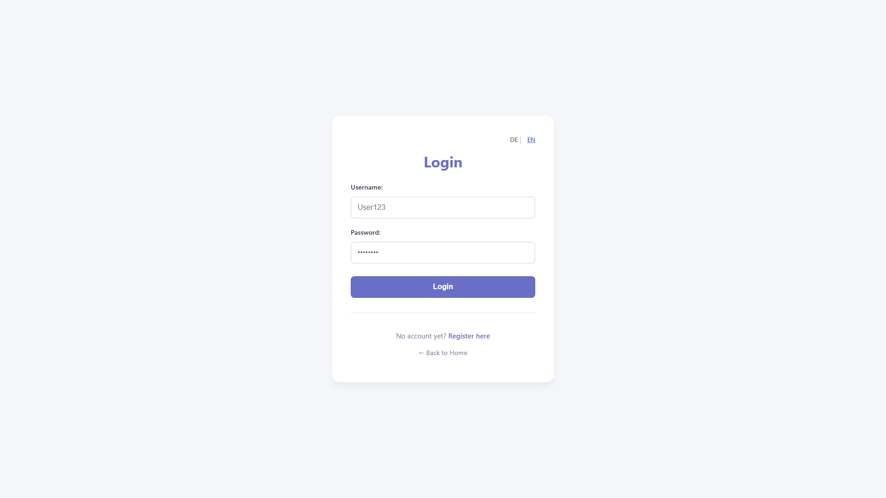
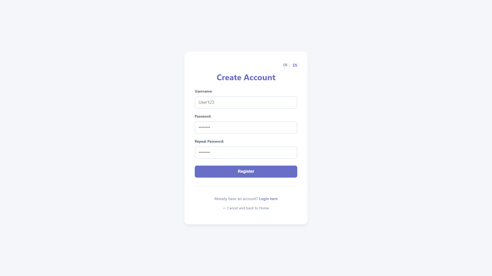
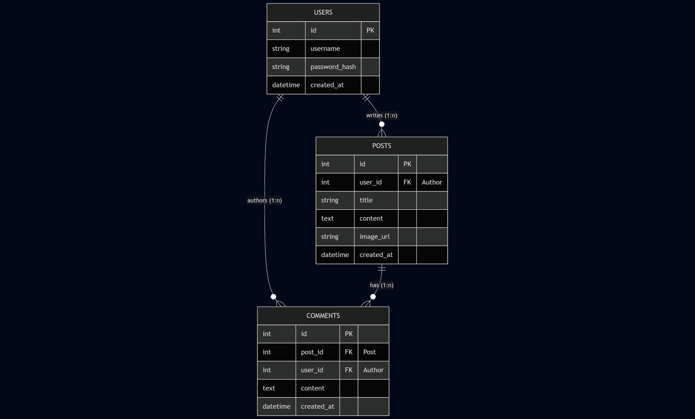

# 📝 Custom PHP MVC Blog


A fully functional, lightweight CMS/Blog engine built from scratch using **native PHP** (no frameworks), **MySQL**, and **Docker**.

This project demonstrates a deep understanding of modern software architecture, featuring a strict **MVC** pattern enhanced with a **Service Layer**, secure authentication, and a custom **Clean UI** design system.

---

## 📸 Gallery

| Homepage (Feed) | Post Detail View |
|:---:|:---:|
|  |  |

| Login | Registration |
|:---:|:---:|
|  |  |

---

## ✨ Key Features

* **Service-Oriented Architecture:** Business logic is strictly separated from Controllers (`Service Layer`), ensuring maintainability and scalability.
* **Strict MVC Pattern:** Clear distinction between Data (`Model`), Presentation (`Templates`), and Logic (`Controller`).
* **Modern Clean UI:** A custom, responsive design system using a refined color palette (Royal Blue/Lavender) and card-based layouts.
* **Secure Authentication:** User registration, login, and session management with `bcrypt` password hashing.
* **Content Management:** Create, read, and display posts with **image upload** validation and processing.
* **Comment System:** Interactive discussion sections for every post.
* **Internationalization (i18n):** Fast, array-based translation system (English/German) with a global helper function.
* **Dockerized Environment:** Zero-config setup including Nginx, PHP-FPM, and MySQL.

---

## 🚀 Getting Started

### Prerequisites

* **Docker** and **Docker Compose** must be installed on your machine.

### 🏁 Quick Start (Windows)

Helper scripts are provided to make managing the environment effortless.

1.  **Start the Server:**
    Double-click `start_server.bat`
    *(Builds and starts Nginx, PHP, and MySQL containers).*

2.  **Open the Application:**
    Visit [http://localhost:8080](http://localhost:8080) in your browser.

3.  **Populate Test Data (Optional):**
    Double-click `seed_data.bat` to automatically generate users, blog posts with images, and comments.

4.  **Reset / Clean Up:**
    Double-click `reset_database.bat` to delete the database and uploaded images (Hard Reset).

5.  **Stop the Server:**
    Double-click `stop_server.bat`.

### 🐧 Quick Start (Linux / macOS)

First, ensure the scripts are executable: `chmod +x *.sh`

1.  **Start:** `./start_server.sh`
2.  **Seed Data:** `./seed_data.sh` (Optional)
3.  **Reset:** `./reset_database.sh`
4.  **Stop:** `./stop_server.sh`

---

## 🧠 Developer Diary

I have included detailed developer diaries in the root directory.
If you are interested in the **"Why"** behind the code, check these files. They contain a chronological log of my thought process, challenges faced, and the reasoning behind specific architectural decisions.

* `devdiary_en.txt` (English)
* `devdiary_de.txt` (German)
* `devdiary_raw.txt` (German)

---

## 📂 Project Structure

The project follows a clean separation of concerns:

```plaintext
/project-root
├── public/             # Webroot (Entry point index.php, Assets, Uploads)
├── src/
│   ├── Controller/     # Handles incoming HTTP requests
│   ├── Model/          # Database interaction (PDO)
│   ├── Service/        # Business Logic, Validation & File Processing
│   ├── Lang/           # Translation arrays (en.php, de.php)
│   └── helpers.php     # Global helper functions (trans())
├── templates/          # Logic-less HTML Views (Home, Auth, Posts)
├── tests/              # Automated database seeding scripts
├── database/           # SQL initialization scripts
└── docker/             # Configuration for Nginx and PHP

```
---

## 🗄️ Database Schema

The relational design visualizes the dependencies between Users, Posts, and Comments, enforced by foreign keys with cascading deletion (as defined in `database/init.sql`).



---

## ⚙️ Configuration & Security

### Database & Environment

* **Credentials:** The environment is pre-configured via `docker-compose.yml`.
* **DB Host:** `db`
* **User/Pass:** `root` / `root`


* **Timezone:** Currently hardcoded to `Europe/Berlin` in `uploads.ini`.

### Security Measures

* **Password Hashing:** Uses PHP's native `password_hash()` (Bcrypt).
* **XSS Protection:** All output is escaped using `htmlspecialchars()` in the views.
* **SQL Injection Protection:** All database queries use **Prepared Statements** (PDO).
* **Input Validation:** Strict Allow-List validation for files (MIME/Ext) and data in the Service Layer.

---

## 🛠️ Tech Stack

* **Backend:** PHP 8.3 (Native)
* **Database:** MySQL 8.0
* **Web Server:** Nginx (Alpine Linux)
* **Frontend:** HTML5, CSS3 (Custom Design System, No Frameworks)
* **Tooling:** Composer (Autoloading), Docker Compose

---

## 📜 License

This project was created for educational purposes. Feel free to use it as a learning resource.