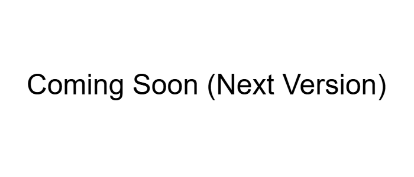

# 📝 Custom PHP MVC Blog


A fully functional, lightweight CMS/Blog system built from scratch using **native PHP** (no frameworks), **MySQL**, and **Docker**.

This project demonstrates a deep understanding of core web technologies, including MVC architecture, secure authentication, object-oriented programming, and containerization.



---

## ✨ Features

* **Strict MVC Architecture:** Clean separation of business logic (`Controller`), data handling (`Model`), and presentation (`Templates`).
* **Authentication System:** Secure user registration, login, and session-based logout.
* **Blog Management:** Create, read, and display posts with **image upload** support.
* **Comment System:** Interactive comment sections for every post.
* **Internationalization (i18n):** Dynamic language switching (English/German) using session handling.
* **Dockerized Environment:** Zero-config setup including Nginx, PHP-FPM, and MySQL.

---

## 🚀 Getting Started

### Prerequisites

* **Docker** and **Docker Compose** must be installed on your machine.

### 🏁 Quick Start (Windows)

I have provided helper scripts to make managing the environment effortless.

1. **Start the Server:**
   Double-click `start_server.bat`
   *(Builds and starts Nginx, PHP, and MySQL containers).*

2. **Open the Application:**
   Visit [http://localhost:8080](http://localhost:8080) in your browser.

3. **Reset / Clean Up (Optional):**
   Double-click `reset_server.bat` to delete the database and uploaded images (Hard Reset).

4. **Stop the Server:**
   Double-click `stop_server.bat`.

### 🐧 Quick Start (Linux / macOS)

First, ensure the scripts are executable: `chmod +x *.sh`

1. **Start:** `./start_server.sh`
2. **Reset:** `./reset_server.sh`
3. **Stop:** `./stop_server.sh`

---

## 🧠 Developer Diary

I have included a `devdiary.txt` file in the root directory.
If you are interested in the **"Why"** behind the code, check this file. It contains a log of my thought process, challenges faced, and the reasoning behind specific architectural decisions I made during development.

---

## 📂 Project Structure

The project follows a strict **Model-View-Controller** pattern located in the `src` directory.

```plaintext
/src
├── Controller/   # Handles incoming requests (e.g., AuthController, PostController)
├── Model/        # Database interaction & Entities (User, Post, Comment)
├── Service/      # Utilities (Database Connection, Helper functions)
├── Lang/         # Translation files (en.php, de.php)
└── templates/    # HTML Views (organized by feature: post/, user/)

/public           # Webroot (Entry point index.php, Assets, Uploads)
/docker           # Configuration files for Nginx and PHP
/database         # SQL initialization scripts

```

---

## 🗄️ Database Schema

The relational design visualizes the dependencies between Users, Posts, and Comments, enforced by foreign keys with cascading deletion (as defined in `database/init.sql`).


---

## ⚙️ Configuration & Security

### Database & Environment

* **Credentials:** The environment is pre-configured via `docker-compose.yml`.
* **DB Host:** `db`
* **User/Pass:** `root` / `root`


* **Timezone:** Currently hardcoded to `Europe/Berlin` in `uploads.ini`.

### Security Measures

* **Password Hashing:** Uses PHP's native `password_hash()` (Argon2/Bcrypt).
* **XSS Protection:** All output is escaped using `htmlspecialchars()` in the views.
* **SQL Injection Protection:** All database queries use **Prepared Statements** (PDO).
* **Validation:** Server-side validation for inputs and file uploads (MIME type, size).

---

## 🛠️ Tech Stack

* **Backend:** PHP 8.3 (Native)
* **Database:** MySQL 8.0
* **Web Server:** Nginx (Alpine Linux)
* **Frontend:** HTML5, CSS3 (Custom Styling)
* **Tooling:** Composer (Autoloading only), Docker Compose

---

## 📜 License

This project was created for educational purposes. Feel free to use it as a learning resource.